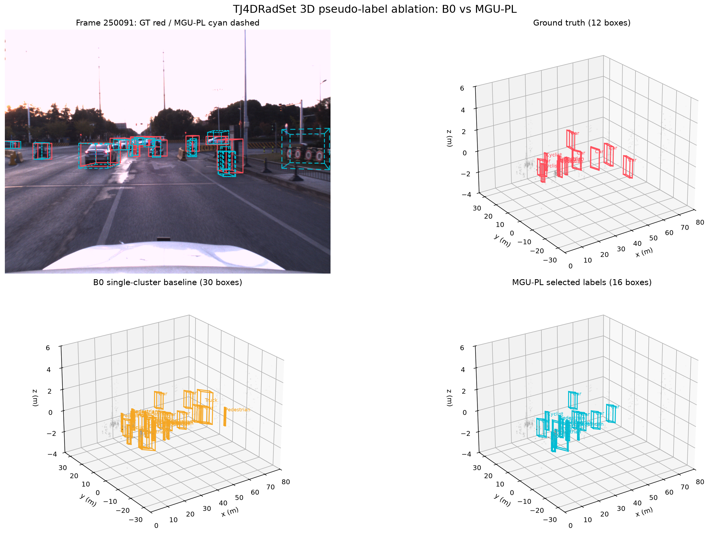
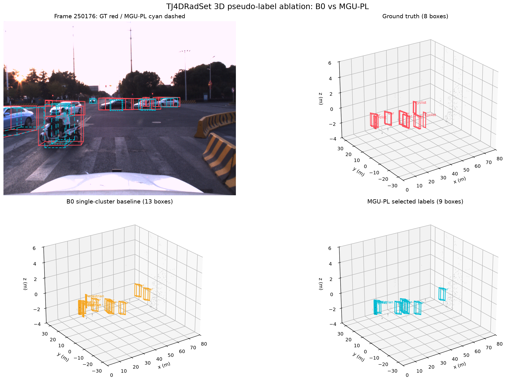
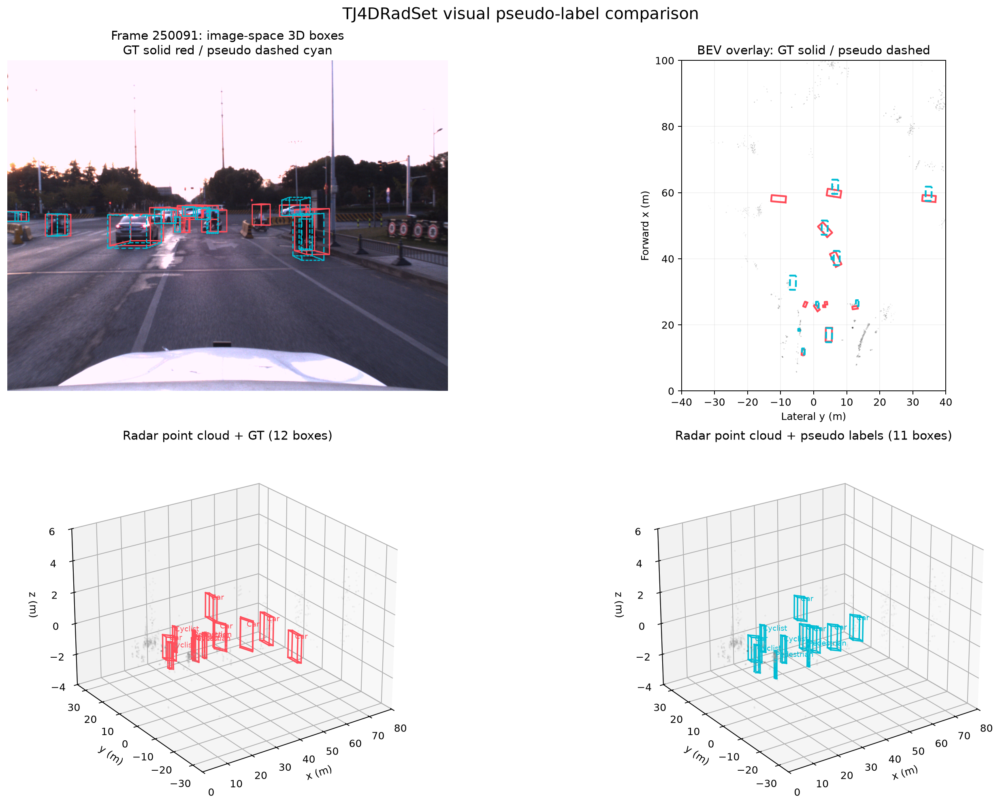
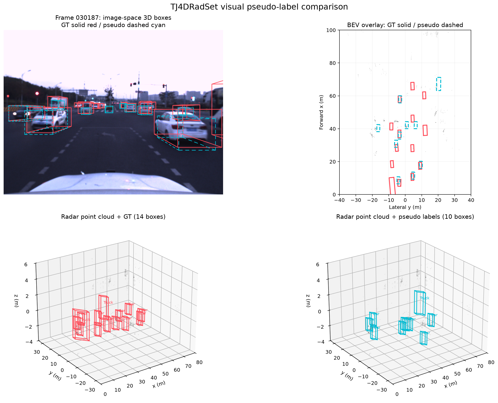
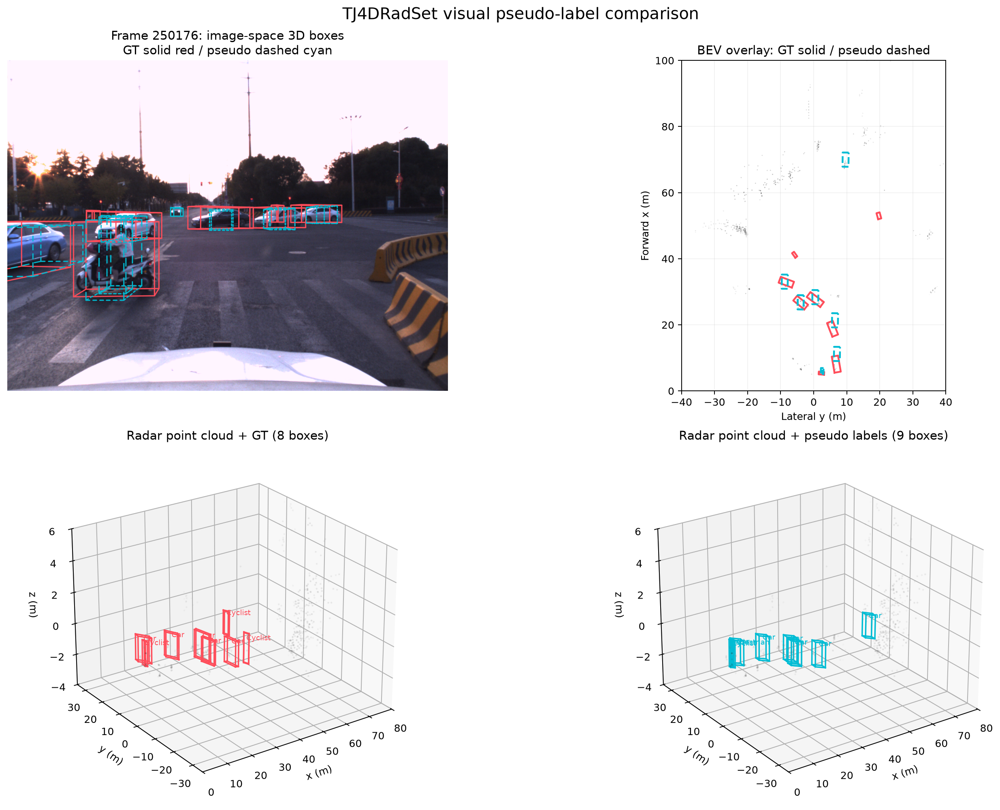

# TJ4DRadSet 视觉—雷达 3D 伪标签

本项目构建并评估一条可复现的研究流水线：用同步图像产生 2D 实例与公制深度，通过 4D 毫米波雷达修正 3D 中心，生成 KITTI 格式 3D 伪标签，再用完全相同的雷达 BEV 学生网络与真值对照训练。

当前方法称为 **MGU-PL（Multi-hypothesis Geometry and Uncertainty Pseudo Labels）**，核心不是更换成熟 2D 模型，而是研究不确定的 2D→3D 转换：

1. 对掩码内雷达点生成多个深度簇候选，不再默认选择“点最多”的簇；
2. 联合视觉深度、雷达支持度、簇紧致度、速度一致性和掩码中心性评分；
3. 默认使用稳定的类别尺寸/道路朝向先验，仅对高置信 Truck 启用 2D 重投影几何优化；
4. 分离类别、中心、尺寸、朝向四种质量权重，让学生模型有选择地学习可靠属性。

## 环境与数据

- 数据集：`D:\BaiduNetdiskDownload\TJ4DRadSet_Full`
- Python：`C:\Users\lth\miniconda3\envs\radar_pseudo\python.exe`
- GPU：RTX 5060 Laptop GPU，PyTorch 2.11.0 + CUDA 12.8
- 数据不会提交到仓库；`velodyne/*.bin` 每点含 `X, Y, Z, V_r, Range, Power, Alpha, Beta` 八个 float32 特征。

```powershell
$env:PYTHONPATH = "src"
$python = "C:\Users\lth\miniconda3\envs\radar_pseudo\python.exe"
& $python -m pytest -q
```

## 可复现流程

先建立序列互斥的训练/方法开发划分，避免相邻帧泄漏：

```powershell
& $python -m radar_pseudo.make_protocol_splits `
  --dataset-root D:\BaiduNetdiskDownload\TJ4DRadSet_Full `
  --train-file D:\BaiduNetdiskDownload\TJ4DRadSet_Full\ImageSets\train.txt `
  --output-root outputs\protocol_splits_v2
```

批量生成多假设关联标签（命令支持断点续跑）：

```powershell
& $python -m radar_pseudo.batch_generate `
  --dataset-root D:\BaiduNetdiskDownload\TJ4DRadSet_Full `
  --split-file outputs\protocol_splits_v2\train_core.txt `
  --output-root outputs\pseudo_mgu_assoc_train_core `
  --method mgu --quality-threshold 0.0 --confidence 0.05 --image-size 1280
```

仅对高置信 Truck 做选择性重投影几何修正：

```powershell
& $python -m radar_pseudo.refine_geometry `
  --split-file outputs\protocol_splits_v2\train_core.txt `
  --input-root outputs\pseudo_mgu_assoc_train_core `
  --output-root outputs\pseudo_mgu_final_train_core `
  --mode selective_reprojection_direct `
  --dataset-root D:\BaiduNetdiskDownload\TJ4DRadSet_Full `
  --confidence-threshold 0.5 --reprojection-classes Truck
```

使用方法开发集上冻结的逐类中心质量阈值选择训练标签：

```powershell
& $python -m radar_pseudo.filter_pseudo_labels `
  --split-file outputs\protocol_splits_v2\train_core.txt `
  --input-root outputs\pseudo_mgu_final_train_core `
  --output-root outputs\pseudo_mgu_final_selected_train_core
```

用标准 BEV/3D IoU 与 R40 AP 评估伪标签：

```powershell
& $python -m radar_pseudo.evaluate_labels_3d `
  --dataset-root D:\BaiduNetdiskDownload\TJ4DRadSet_Full `
  --split-file outputs\protocol_splits_v2\teacher_calibration.txt `
  --prediction-dir outputs\pseudo_mgu_final_direct_teacher_calibration_v2\label_2 `
  --metadata-dir outputs\pseudo_mgu_final_direct_teacher_calibration_v2\metadata `
  --output outputs\evaluation\mgu_final_direct_calibration_v2_standard3d.json
```

学生网络训练时，`--metadata-dir` 启用属性级不确定性权重；使用稀疏真值公平对照时，`--ignore-label-dir` 会屏蔽被预算省略目标附近的负样本损失。

```powershell
& $python -m radar_pseudo.train_student `
  --dataset-root D:\BaiduNetdiskDownload\TJ4DRadSet_Full `
  --split-file outputs\protocol_splits_v2\train_core.txt `
  --label-dir outputs\pseudo_mgu_final_selected_train_core\label_2 `
  --metadata-dir outputs\pseudo_mgu_final_selected_train_core\metadata `
  --output-dir outputs\student_mgu_seed42 --epochs 20 --batch-size 8 --seed 42
```

## 已验证的开发集结果

开发集含 1,061 帧，按完整采集序列与训练集互斥；评估范围 70 m，车辆 IoU=0.5，行人/骑行者 IoU=0.25。

| 方法 | mAP BEV R40 | mAP 3D R40 |
|---|---:|---:|
| B0：单簇基线 | 8.69% | 2.39% |
| B1：多假设关联 + 类别几何先验 | 12.45% | 4.78% |
| B2：B1 + 类别/置信度选择性重投影 | **12.40%** | **5.32%** |

B2 相对 B0 的 BEV mAP 提升约 43%，3D mAP 提升约 122%。PCA 自适应几何的 3D mAP 为 3.72%，已通过消融实验否决，没有被包装成正结果。详见 [方法与实验记录](docs/mgu_method_and_results.md)。

冻结方法后的学生三种子实验进一步验证：MGU-PL 相对 B0 将 2 m/4 m 中心 mAP 从 5.80%/8.68% 提升到 8.30%/11.59%，BEV 从 1.01% 提升到 2.83%，3D 从 0.12% 提升到 1.05%。详见 [最终多种子结果](docs/final_multiseed_results.md)。

## 可视化

同一帧的 B0、MGU-PL 与真值 3D 点云对比：





第一轮点云、真值与伪标签对比图：







这些图像含数据集相机画面，远程仓库应保持私有。项目不会提交 TJ4DRadSet 原始数据、批量输出或模型权重。
